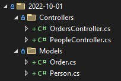

# Api Versioning Sample with Open API

You can view the hosted sample at [https://openapiversionsample.azurewebsites.net](https://openapiversionsample.azurewebsites.net).

There are four parts to incorporate API versioning into your application
but before we get into that, let's talk about a few API versioning guidelines.

1) Have a resource object per API version. This is the ensure that clients
are not surprised in the future when properties are added/removed or renamed.
2) Prefer passing version information in the request header or query string.
3) Avoid using version as part of the URL because it violates the RESTful principles of URI.

Sample layout:

  

## Adding API Versioning to your application

### Part 1: Add API versioning NuGet package to the project file. (*.csproj)

```xml
<PackageReference Include="Asp.Versioning.Mvc.ApiExplorer" Version="6.1.0" />
```

### Part 2: Add API versioning to the service collection

This is also where you can configure the API versioning options like deprecating an API version.

```csharp
builder.Services.AddApiVersioning(
                    options =>
                    {
                        // reporting api versions will return the headers
                        // "api-supported-versions" and "api-deprecated-versions"
                        options.ReportApiVersions = true;

                        options.Policies.Sunset(0.9)
                                        .Effective(DateTimeOffset.Now.AddDays(60))
                                        .Link("policy.html")
                                            .Title("Versioning Policy")
                                            .Type("text/html");
                    })
                .AddMvc()
                .AddApiExplorer();
```

### Part 3: Add API Version attribute to the controller

```csharp
[ApiVersion(1.0)]
[ApiVersion(0.9, Deprecated = true)]
```

or

```csharp
[ApiVersion("2022-10-01")]
```

### Part 4: Add API Version to OpenAPI document (Swagger)

#### Copy files

Copy the following two files and updated as needed.

* [ConfigureSwaggerOptions.cs](src/ApiVersioningSample/ConfigureSwaggerOptions.cs) - Needed to generate the OpenAPI document for each version.
* [SwaggerDefaultValues.cs](src/ApiVersioningSample/SwaggerDefaultValues.cs) - is desired to 
  * Have a way to connect a deprecated API because it is not in the API explorer model.
  * Honor ApiDescription.Parameters[#].Description when present. It only uses XML comments which may not exist for the API version parameter.
  * Honor ApiDescription.Parameters[#].DefaultValue when present, which is useful to set so a user doesn't have to enter an API Version.

#### Add `SwaggerGenOptions` to the service collection

```csharp
builder.Services.AddTransient<IConfigureOptions<SwaggerGenOptions>, ConfigureSwaggerOptions>();
```

#### `AddSwaggerGen` to the service collection

```csharp
builder.Services.AddSwaggerGen(
    options =>
    {
        // add a custom operation filter which sets default values
        options.OperationFilter<SwaggerDefaultValues>();

        var fileName = typeof(Program).Assembly.GetName().Name + ".xml";
        var filePath = Path.Combine(AppContext.BaseDirectory, fileName);

        // integrate xml comments
        options.IncludeXmlComments(filePath);
    });
```    

#### Add Swagger to the application pipeline

```csharp
app.UseSwagger();
app.UseSwaggerUI(
    options =>
    {
        options.RoutePrefix = string.Empty; // make home page the swagger UI
        var descriptions = app.DescribeApiVersions();

        // build a swagger endpoint for each discovered API version
        foreach (var description in descriptions)
        {
            var url = $"/swagger/{description.GroupName}/swagger.json";
            var name = description.GroupName.ToUpperInvariant();
            options.SwaggerEndpoint(url, name);
        }
    });
```

## [Additional samples link](https://github.com/dotnet/aspnet-api-versioning/tree/main/examples)
